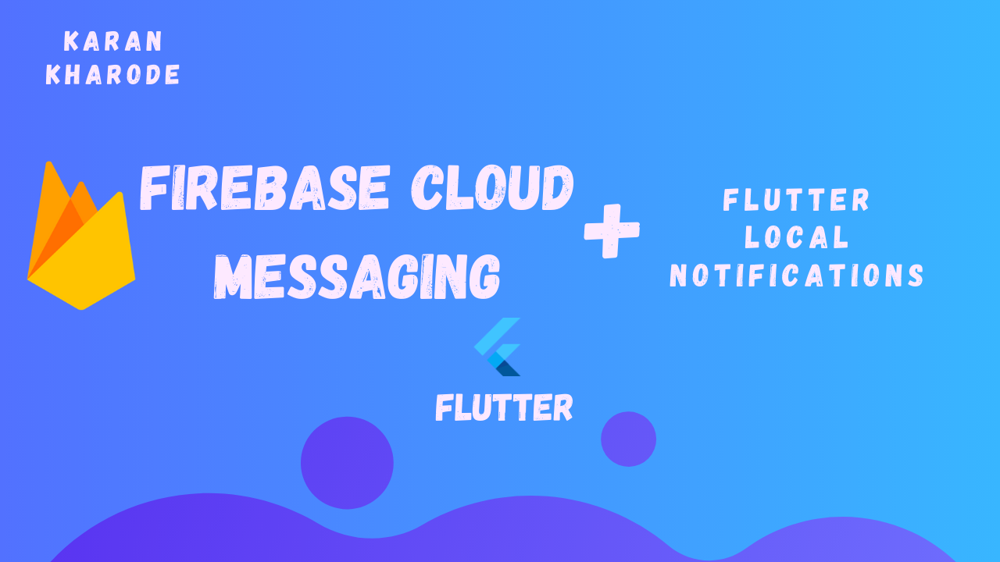
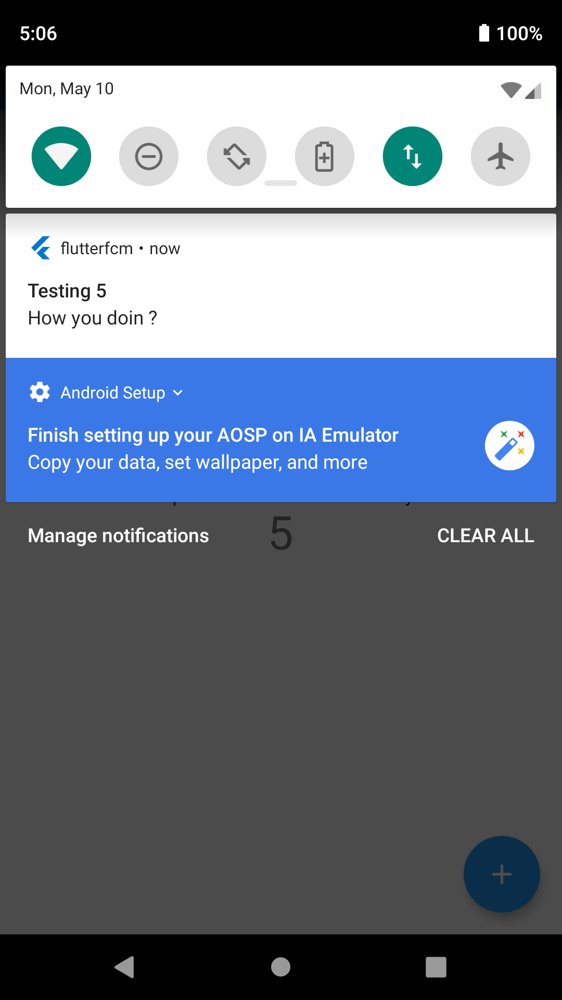
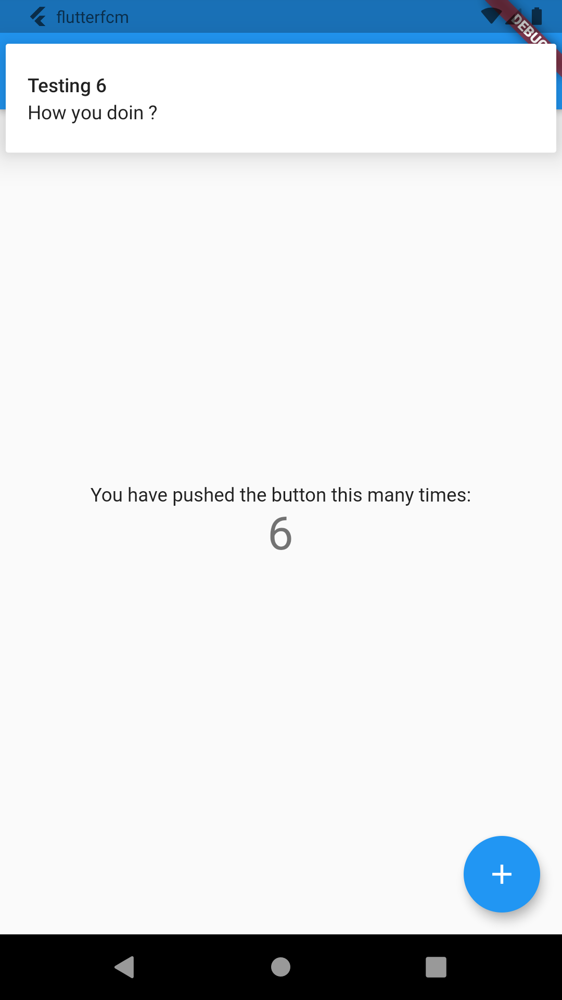

# Flutter-Course 

### Show some :heart: and star the repo to support the project

---
I have started a Flutter Course for beginners,
This is Basics to Advanced Course.
That too at an unbelievable price.
# To enroll for the course contact immediately.
([Instagram](https://www.instagram.com/karan_kharode))
---

This repository is a tutorial for implementing the Push Notifications in Flutter using Firebase Cloud Messaging and Flutter Local Notifications.

  

---

For video tutorial go to my Youtube channel by clicking on the link below

## Flutter 2.0 Firebase Push Notifications
[Youtube 😎](https://youtu.be/pVUIU_nq8MU)

## YouTube Channel

Subscribe here !!
[Programming with Karan Kharode 😎](https://www.youtube.com/c/ProgrammingwithKaranKharode)

## Telegram Community

Join the wonderful community for continous and all time support with your Flutter Development ! 
[The Flutter Community :india:](https://karankharode.page.link/theFlutterCommunity)

## ✨ Requirements
* Any Operating System (ie. MacOS X, Linux, Windows)
* Any IDE with Flutter SDK installed (ie. IntelliJ, Android Studio, VSCode etc)
* A little knowledge of Programming
* A brain to think 🤓🤓

## 🤓 Author(s)
**Karan Kharode** [Youtube](https://www.youtube.com/c/ProgrammingwithKaranKharode)

### Created & Maintained By

[Karan Kharode](https://github.com/karankharode) ([@KaranKharode](https://www.twitter.com/KaranKharode)) ([YouTube](https://www.youtube.com/c/ProgrammingwithKaranKharode))
([Instagram](https://www.instagram.com/karan_kharode))

> If you found this project helpful or you learned something from the source code and want to thank me, consider buying me a cup of :coffee:
>     
> - [Razorpay](https://rzp.io/l/PuLyou2cv)
